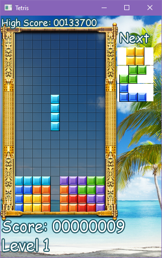

# Normal Tetris

Normal Tetris.

Higher levels award more points per line clear. You also get a few points for putting a piece on the board. However, be careful &mdash; higher levels also make the game harder. Pieces fall faster, and you may see some new ones too.

- R &mdash; (Re)start game.
- Z and X &mdash; Rotate piece.
- Left and Right &mdash; Move piece.
- Down &mdash; Drop piece faster.
- Up &mdash; Drop piece even faster. (Instant)

